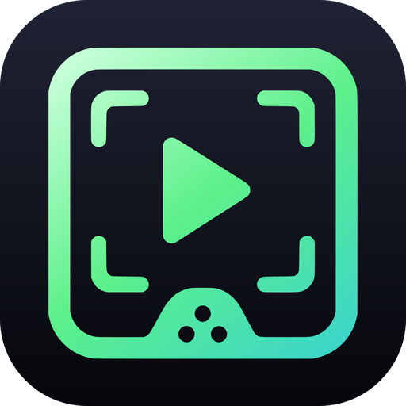

<p align="center">
  
</p>

<h1 align="center">Mira — Low-latency Capture Viewer</h1>

<p align="center">
  <strong>A Linux viewer for Elgato and v4l2 capture cards, tuned for sub-30ms latency.</strong>
</p>

<p align="center">
  <a href="https://github.com/darkharasho/mira/releases/latest"></a>
  <a href="https://github.com/darkharasho/mira/blob/main/LICENSE"></a>
  <a href="https://github.com/darkharasho/mira/releases"></a>
</p>

---

## Plug in. See it. No middleman.

Mira is a desktop capture viewer built around one goal: make your Elgato (or any v4l2/USB capture card) feel like a direct passthrough on Linux. No OBS preview window, no browser source, no hand-rolled mpv wrapper script. Just a clean window, a tight audio path, and frames on screen the moment they arrive.

Validated on Bazzite (Fedora) + KDE Plasma + Wayland with an Elgato Game Capture Neo at `/dev/video2`.

---

## Features

### Sub-30ms capture latency
Mira drives mpv via IPC and routes audio through a custom dsnoop ALSA wrapper, bypassing PulseAudio's buffering. Frames hit the screen with the same responsiveness you'd get from a hardware monitor pass-through.

### Dark Glass control surface
The Tauri window is a transparent overlay — floating pill bar, slide-in settings panel, live stats overlay — layered above the video. Controls fade out 2.5 seconds after your mouse stops moving and snap back the instant you nudge it.

### Position-locked sibling video window
mpv runs as a borderless sibling window, geometry-tracked to the Tauri shell via a one-shot KWin script. Move the window, the video moves with it. The two look like one for normal use; embedded subsurface rendering is on the roadmap.

### Hot-pluggable devices
Unplug the Elgato or reload `uvcvideo` and the device dropdowns update without a restart. Pixel formats and ALSA capture sources are enumerated live from v4l2 and ALSA.

### One-key control
`F` toggles fullscreen, `M` mutes audio, `S` flips the stats overlay, `P` saves a screenshot to `~/Pictures/mira/`. `Esc` closes panels or drops out of fullscreen, `Q` quits.

### Settings that don't restart your day
Pick a different pixel format or audio device and click Apply — Mira restarts the stream cleanly without dropping the window or losing your place. Settings persist between launches; cold relaunch reconnects automatically and skips the startup screen.

### Signed auto-updates
Release builds are signed with minisign and verified on download. The updater pulls from GitHub Releases — check from `Settings → Check for updates`, review the new version, and relaunch into it.

### AppImage that just runs
Mira ships as a single AppImage with all runtime libs bundled. Works on the host even though builds happen inside a Fedora distrobox to avoid layering devel packages on Bazzite's locked mesa stack.

---

## Quick start

### Download

Grab the latest release:

- **Linux** — [AppImage](https://github.com/darkharasho/mira/releases/latest)

### Prerequisites

- A v4l2-compatible capture device (Elgato Game Capture Neo, HD60 X, or any UVC USB capture card)
- ALSA (`alsa-lib`)
- mpv runtime libs (bundled in the AppImage)
- KDE Plasma + Wayland recommended; X11 works but the KWin geometry script is KDE-specific

### Build from source

Builds happen inside a Fedora distrobox so devel headers don't get layered on the host:

```bash
distrobox create --name elgato-dev --image registry.fedoraproject.org/fedora-toolbox:42
distrobox enter elgato-dev -- bash -lc "sudo dnf install -y \
  alsa-lib-devel mpv-libs-devel libudev-devel webkit2gtk4.1-devel \
  gcc gcc-c++ pkgconf-pkg-config nodejs cargo"
```

For AppImage bundling, drop `linuxdeploy-x86_64.AppImage` and `appimagetool-x86_64.AppImage` (from upstream GitHub releases) onto the distrobox `$PATH`.

```bash
git clone https://github.com/darkharasho/mira.git
cd mira
npm install
npm run app:dev          # development (hot reload)
npm run app:build        # release AppImage
```

The npm scripts shell into the `elgato-dev` distrobox for you:

```bash
npm run app:dev      # tauri dev
npm run app:build    # release AppImage
npm run app:test     # rust unit tests
npm run app:shell    # drop into the container
```

Vite-only commands (`npm run dev`, `npm run build`) run on the host — they don't need libmpv/ALSA headers.

---

## Tech stack

| Layer       | Technology                              |
|-------------|-----------------------------------------|
| Framework   | Tauri 2                                 |
| Frontend    | React 18, TypeScript, Vite              |
| Styling     | Tailwind CSS v4                         |
| Video       | mpv via IPC                             |
| Audio       | ALSA dsnoop wrapper                     |
| Window mgmt | KWin scripting (KDE Plasma)             |
| Updates     | tauri-plugin-updater (minisign signed)  |

---

## Hotkeys

| Key   | Action                          |
|-------|---------------------------------|
| `F`   | Toggle fullscreen               |
| `M`   | Toggle mute                     |
| `S`   | Toggle stats overlay            |
| `P`   | Take screenshot                 |
| `Esc` | Close panel / exit fullscreen   |
| `Q`   | Quit                            |

---

## Known limitations

- **Two windows.** mpv runs as a sibling top-level window position-locked to the Tauri window. Brief geometry mismatch on rapid drag/resize is possible. Embedded subsurface rendering is deferred.
- **KWin scripting is best-effort.** The `keepBelow` + `noBorder` script runs once ~1.5s after Tauri startup. If you click Start later than that, the mpv window may briefly appear above — toggle Apply in Settings to nudge the script.
- **Fallback script.** The `~/.local/bin/elgato-capture.sh` workflow remains untouched and works as a backup if the app misbehaves.

---

## Spec & plan

- Spec: [`docs/superpowers/specs/2026-05-04-capture-app-design.md`](docs/superpowers/specs/2026-05-04-capture-app-design.md)
- Implementation plan: [`docs/superpowers/plans/2026-05-04-capture-app.md`](docs/superpowers/plans/2026-05-04-capture-app.md)

---

## Contributing

Contributions welcome. Fork, branch, PR.

```bash
git checkout -b my-feature
# make your changes
npm run app:build        # make sure it builds
```

---

## License

See [LICENSE](LICENSE) for details.

---

<p align="center">
  <sub>Built for low-latency Linux capture, without the wrapper-script tax.</sub>
</p>
